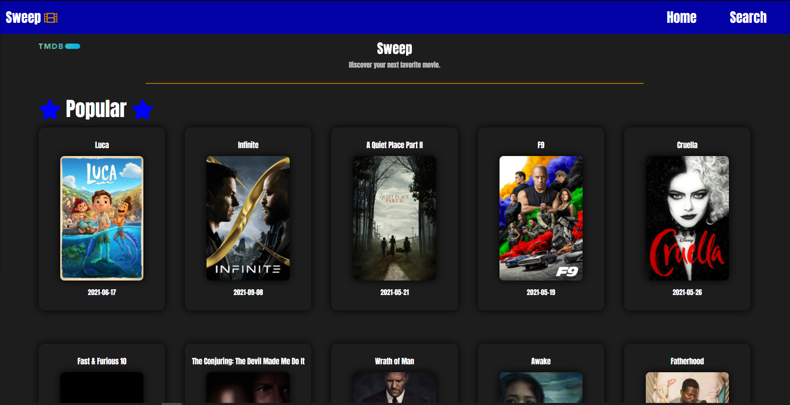
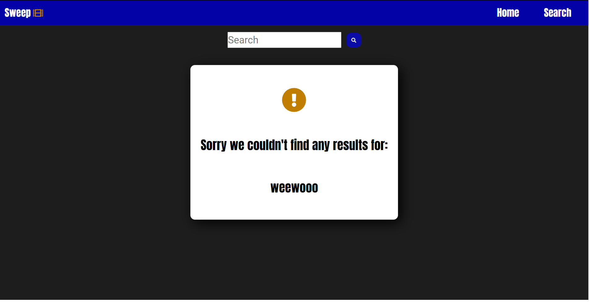

# Sweep

## Table Of Contents

- [Description](#description)
- [Deployed Application](###deployed-Application)
- [User Story](#user-Story)
- [Installation](#installation)
- [Screenshots](#screenshots)
- [Contributors](#contributors)

## Description

Sweep is an online database of information related to movies. Users are able to browse a collection of movies including popular, top rated, and movies currently playing in theaters. Users are also able to search for specific movies and view a variety of information such as the movies trailer, release date, description, actors, and more.

## Deployed-Application

https://colinjhedwards.github.io/Sweep/

## User-Story

    As A movie enthusiast,

    I WANT to be able to browse a collection of movies and search for specific movies,

    SO THAT I can either learn more about a specific movie or decide what movie to watch next.

## Installation

- Clone the repository from https://github.com/ColinJhEdwards/Sweep.
- Cd into the correct folder and enter "npm i" to install necessary packages.
- Enter "npm start" to start the server.

## Screenshots

## Contributors

This app brought to you by:

- Colin Edwards https://github.com/ColinJhEdwards
